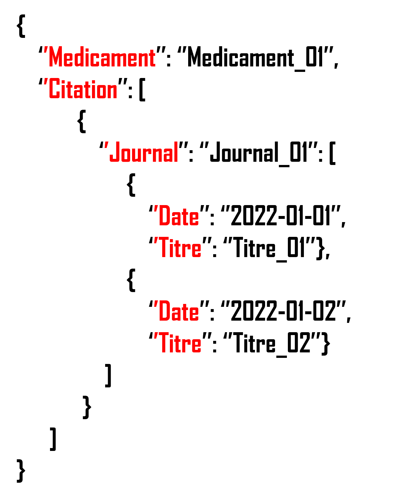

# TestServier

## Construction d'un pipeline: graphe de liaison médicaments - publications

## Objectif

Produire un fichier JSON donnant une représentation sous forme de graphe des liens 
entre les médicaments et les publications les ayant citées. Une citation est définie par utilisation du nom du
médicament dans le titre de la publication.

## Données en entrées

- drugs.csv : liste des noms des médicaments
- clinical_trials.csv : titres d'articles PubMed / Journal / Date / Id
- pubmed.csv : structure identique à celle du fichier clinical_trials.csv
- pubmed.json : structure similaire au fichier pubmed.csv mais au format json.

## ETL

Cet ETL est construit en utilisant l'ordonnanceur de tâche Apache Airflow.
Un DAG 'drugs_mapping' a été crée pour réaliser ces tâches
Chaque étape de l'ETL est constituée d'une ou plusieurs tâches. 
Chaque tâche du DAG est un opérateur Python.

### Extract

L'étape d'extraction est constituée des trois tâches :

 - **get_list_files** : cette tâche liste les fichiers qui doivent être traités. les fichiers sont distingués selon leur format: csv ou json.
 - **extract_csv_to_df** : cette tâche va lire les fichiers CSV et les agréger dans un dataframe python sauvegardé au format CSV.
 - **extract_json_to_json** : cette tâche va lire les fichiers JSON et les agréger dans un dataframe python sauvegardé au format CSV.

### Transform

L'étape de transformation est constituée de la tâche **transform_drugs_publication**.
Cette étape consiste à standardiser l'ensemble des données et concaténer les deux dataframe issus des tâches **extract_csv_to_df** et **extract_json_to_json** de l'étape d'extraction.
L'analyse des titres des publications permet de déterminer si un ou plusieurs médicaments est cité. 

### Load

L'épate de chargement est constitué de la t^che **load_to_json**.
Cette étape met en forme la table des données finales issues de la tâche précédente et la met en forme avant de la sauvegarder au format CSV. 

## Donnée de sortie

La donnée de sortie donne le mapping des médicaments (Key 'Medicament'). 
Pour chaque médicament, la clé 'Citation' donne les liens du médicament aux citations dans les publications (key 'Citation'). 
Chaque journal ayant cité au moins une fois un médicament est lié à ce médicament (key 'Journal').
Pour chaque journal, on liste les publications avec la date de publication (key 'Date') et le titre de la publication (key 'Titre').

